Carrera de Especialización en Sistemas Embebidos - Universidad de Buenos Aires
---
# Arquitectura de Microprocesadores

## Familias de microprocesadores/microcontroladores de ARM
### ARM Cortex A (Application profile)
Proveen una variedad de soluciones para dispositivos que hacen uso intensivo de sistemas operativos de propósito general.
Están optimizados para correr múltiples aplicaciones a la vez. No están orientado a cumplir requisitos de tiempo real.
- Motor de procesamiento de media NEON
- Trustzone para extensiones de seguridad
- Soporte para punto flotante de precisión single y double
- Soporte para varios sets de instrucciones

### ARM Cortex R (Real-time profile)
Los procesadores Cortex-R apuntan a aplicaciones de tiempo real de alto rendimiento, como controladores de discos duros, equipos de redes, aplicaciones de la industria automotriz como airbags, sistemas de freno, etc. Es similar a un microcontrolador de alto rendimiento pero apunta a sistemas más grandes.

Utilizarán un sistema operativo de tiempo real.

### ARM Cortex M (Microcontroller profile)
Es un Cortex-R pero más reducido, simple y de menor costo. Apuntan al mercado de microcontroladores.
Se los puede encontrar implementado como soft-core en FPGAs, pero es más común encontrarlos en microcontroladores con memorias integradas, relojes y periféricos.

Algunos se encuentran optimizados para un consumo eficiente de energía, otros para alto rendimiento y otros para mercados específicos como puede ser el de dispositivos inteligentes.

Los Cortex-M3 y Cortex-M4 son núcleos similares, la principal diferencia es la capacidad de DSP de los Cortex-M4. Ambos utilizan el set de instrucciones Thumb-2.

Por debajo de los Cortex-M3 y Cortex-M4 se ubican los Cortex-M0 y Cortex-M0+. Apuntan a una implementación mínima para bajo consumo y bajo costo. Utilizan un subset de Thumb-2.

## Diferencia entre familias de procesadores Cortex

Comparación de arquitecturas:

|                         | Cortex-M0 y M0+ | Cortex-M3 | Cortex-M4 | Cortex-M7 |
|-------------------------|-----------------|-----------|-----------|-----------|
| Arquitectura ARM        | ARMv6-M         | ARMv7-M   | ARMv7E-M  | ARMv7E-M  |
| Arquitectura de memoria | Von-Neumann     | Harvard   | Harvard   | Harvard   |
| CPU cache               | No              | No        | Posible   | Opcional  |
| Memotia altamente acoplada (TCM) | No | No | No | Opcional |
| [Unidad de Protección de Memoria (MPU)](README.md#unidad-de-protección-de-memoria-mpu) | No (Opcional en M0+) | Opcional | Opcional | Opcional |
| Bit-banding             | Opcional        | Si        | Si        | Si        |
| [SysTick Timer](README.md#systick-timer) | Opcional | Si | Si     | Si        |

Comparación de extensiones:

|                         | Cortex-M0 y M0+ | Cortex-M3 | Cortex-M4 | Cortex-M7 |
|-------------------------|-----------------|-----------|-----------|-----------|
| Unidad de punto flotante| No              | No        | Opcional  | Opcional  |
| Extensiones para DSP    | No              | No        | Si        | Si        |
| Aritmética saturada     | No              | Si        | Si        | Si        |
| División por hardware   | No              | Si        | Si        | Si        |
| Multiplicación por hardware | Resultado de 32-bit | Resultado de 32 o 64-bit | Resultado de 32 o 64-bit | Resultado de 32 o 64-bit |

A partir del procesador Cortex-M3 se soporta todo Thumb-2.

## Tecnología Thumb-2
Todos los procesadores Cortex-M poseen tecnología Thumb-2 y diferentes subsets del ISA Thumb. Previo a Thumb-2, la ISA Thumb era solo para set de instrucciones de 16 bits. Thumb-2 extendió la ISA a un set altamente potente y eficiente que otorga beneficios considerables en términos de facilidad de uso, tamaño de código y rendimiento.

Al permitir instrucciones tanto de 16 como 32 bits, Thumb-2 elimina la necesidad de conmutar el procesador entre estado Thumb (instrucciones de 16 bits) y estado ARM (instrucciones de 32 bits). Esto le permite a los procesadores Cortex-M mezclar instrucciones de 16 y 32 bits sin cambiar de estado, lo que conlleva una gran densidad de código y alto rendimiento, sin añadir complejidad.

## Arquitecture load-store
La arquitectura load-store es una arquitectura cuyo set de instrucciones se divide en dos categorías: De acceso a memoria, asociada a la carga y almacenamiento entre memoria y registros, y operaciones de ALU (unidad aritmética lógica) que solo ocurren entre registros. Si hay información en memoria a ser procesada, primero debe ser cargada en registros, procesada en el procesador y escrita nuevamente en memoria de ser necesario. 

Por ejemplo, en una arquitectura load-store, ambos operandos de una operación ADD deben ser registros. Esto difiere de una arquitectura registro-memoria (por ejemplo CISC) donde alguno de los operandos para la operación ADD  puede encontrarse en memoria y el otro en un registro.

La familia Cortex de ARM  (y en general cualquiera de ARM) es una arquitectura load-store.

## Mapa de memoria de ARM Cortex-M
Con 32 bits para direccionar, los procesadores ARM pueden acceder hasta 4GB de espacio de memoria.
Los 4GB del espacio de dirección de los Cortex-M se particiona en un determinado número de regiones de memoria. La partición se basa en el tipo de uso, de tal forma que las diferentes áreas se diseñan para utilizarse principalmente en:

- Código del progrma
- Acceso a información
- Periféricos
- Control interno del procesador y componentes para debug

La arquitectura permite gran flexibilidad para permitir que las regiones de memoria sean utilizadas con otros propósitos.

En la práctica muchos microcontroladores solo utilizan una porcion de cada región para flash, SRAM y periféricos.

El arreglo del mapa de memoria es consistente entre todos los procesadores Cortex-M. Esto hace que sea más facil portar software de un Cortex-M a otro y permite una mejor reusabilidad de código.

A continuación se observa el mapa de memoria de los procesadores Cortex-M:

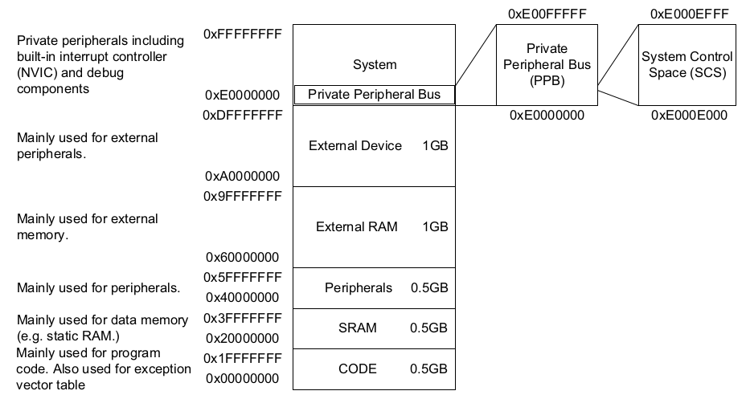

## Modos de operación y estados
Los procesadores Cortex-M3 y M4 tienen dos modos de operación y dos estados de operación. Los procesadores pueden tener niveles de acceso privilegiado y no privilegiado. El acceso privelegiado da acceso a todos los recursos en el procesador, mientras que el acceso no privilegiado deja regiones de memoria inaccesibles y algunas operaciones no pueden ser utilizadas.

En la siguiente figura se observa la máquina de estados finitos con los estados, modos y transiciones:

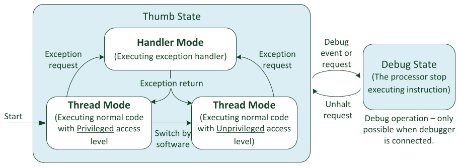

Estados de operación:
- El estado Debug, donde se haltea el procesador por el debugger.
- El estado Thumb, donde el procesador se encuentra ejecutando el programa en modo Thumb. No hay estado ARM porque los procesadores Cortex-M no soportan set de instrucciones ARM.

Modos de operación:
- Modo Handler: Cuando se ejecuta un gestor de excepciones, como puede ser una rutina de interrupción (ISR). En modo Handler el procesador siempre tiene acceso privilegiado.
- Modo Thread: Cuando se ejecuta el código de aplicación normal. El procesador puede o no estar en modo privilegiado.

El software puede cambiar el procesador de acceso privilegiado en modo Thread a no privilegiado en modo Thread pero no vice versa. Para lo último es necesario usar un mecanismo de excepciones que permita la transición.

La separación entre niveles de acceso privilegiado y no privilegiado permite a los diseñadores del sistema desarrollar sistemas embebidos robustos, brindando un mecanismo para hacer seguro el acceso a ciertas regiones críticas de memoria.

Por ejemplo, un sistema con el kernel de un RTOS que se ejecuta con acceso privilegiado y las tareas de la aplicación que se ejecutan en modo no privilegiado. De ese modo puede configurarse la MPU (Memory Protection Unit) para prevenir que las tareas corrompan la memoria y los periféricos usados por el kernel del RTOS y otras tareas. Si una tarea crashea, el resto de las tareas y el kernel del RTOS pueden seguir ejecutándose.

A continuación se observa la inicialización de una tarea y el cambio de contexto en un RTOS:

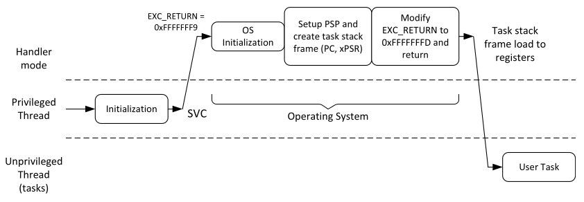

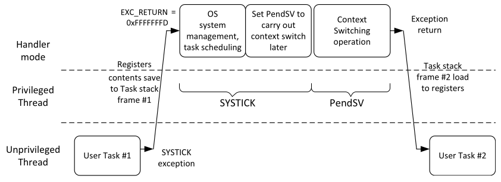

Se puede observar como la transición de modo no privilegiado a privilegiado es a través de la excepción generada por el SysTick.

## Shadowed stack pointer: MSP y PSP
Hay dos stack pointers en los procesadores Cortex-M:

- El MSP (Main Stack Pointer) es el stack pointer por defecto. Es utilizado en modo Thread cuando el bit 1 de CONTROL (SPSEL) es 0, y es utilizado siempre en mode Handle.
- El PSP (Processor Stack Pointer) es el stack pointer utilizado en modo Thread cuando el bot 1 de CONTROL (SPSEL) es 1.

Operaciones de stack como las instrucciones PUSH y POP, y la mayoría de las instrucciones que utilizan el registro SP (R13) utilizan el stack pointer que se encuentre seleccionado en ese momento. 
También se puede acceder al MSP y PSP directamente utilizando las instrucciones MRS y MSR. 

En las aplicaciones simples, sin un RTOS, se puede utilizar solo el MSP e ignorar el PSP.
En sistemas con un RTOS, la gestión de interrupciones utiliza MSP, mientras que las tareas de la aplicación utilizan el PSP. Cada tarea de la aplicación posee su propio espacio de stack y en el cambio de contexto el RTOS actualiza el PSP al espacio correspondiente.

## Ejecución condicional
Los procesadores Cortex-M3 y Cortex-M4 soportan ejecución condicional. Después de la ejecución de una instrucción IT (*If-Then*) hasta 4 instrucciones siguientes pueden ser ejecutadas condicionalmente basado en la condición especificada en la instrucción IT y el valor de APSR.

Por ejemplo:

```asm
CMP R0, #1   ; Comparacion de R0 con 1
ITE EQ       ; La siguiente instruccion se ejecuta si Z esta seteado (T en ITE)
             ; la siguiente se ejecuta si Z no esta seteado (E en ITE)
MOVEQ R3, #2 ; Setea R3 a 2 si EQ
MOVNE R3, #1 ; Setea R3 a 1 si NE
```

La instrucción IT se compondra de acuerdo a las ejecuciones condicionales subsiguientes: ITT, ITTEE, ITETT, o cualquier otra combinación de hasta 4 sentencias.

## Reset, NMI y Hardfault
La excepciones de reset, NMI y Hardfault tienen nivel de prioridad fijo (no configurable) y se representan con números negativos para indicar que tienen prioridad mayor al resto. Las prioridades son las siguientes:

- Reset: prioridad -3 (la más alta)
- NMI: prioridad -2
- Hard fault: prioridad -1

La excepción **NMI (*Non-Maskable Interrupt*)** es una excepción no enmascarable y no puede deshabilitarse. Puede utilizarse con timer watchdog o un detector de brownout (caída de voltaje).

La exepción de **HardFault** puede producirse por una excepción configurable de falla que haya escalado, por un error en el bus durante el fetch de un vector, o por la ejecución de una instrucción de breakpoint (BKPT) cuando se esta utilizando un debugger.

## Stack
El stack (o pila) es un mecanismo para uso de memoria que permite usar una porción de memoeria como un buffer LIFO (Last-In-First-Out).
Los princepales instrucciones a ejecutar sobre el stack son PUSH, para guardar un dato, y POP, para obtener un dato.
Cada vez que se ejecuta una instrucción PUSH o POP, se opera sobre el stack que este seleccionado en ese momento.

El stack puede ser utilizado para:

- Almacenamiento temporal de información cuando una función ejecutada necesita utilizar un registro.
- Pasar información a funciones o subrutinas (argumentos).
- Para almacenar variables locales.
- Para mantener el estado del procesador y el valor de los registros en caso de una excepción/interrupción.

Los procesadores Cortex-M utilizan un modelo de memoria de stack denominado "full-descending stack". En la siguiente figura se observa una representación de las operaciones de PUSH y POP:

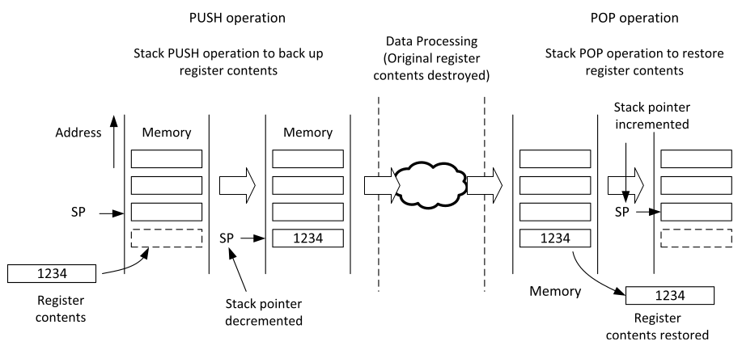

### Uso de PUSH y POP en funciones
Uno de los usos más comunes de las instrucciones PUSH y POP es almacenar el contenido de los registros cuando es ejecuta el llamado a una función o subrutina.

En la siguiente figura se puede observar el llamado a la función *function1*:

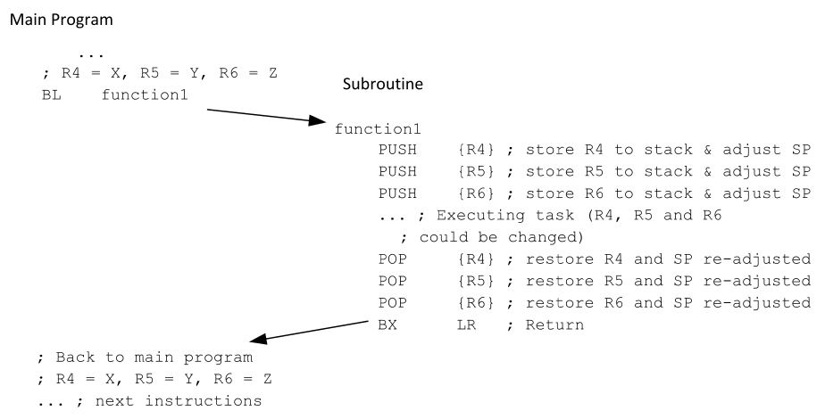

Como *function1* nesecita utilizar y modificar los registros R4, R5 y R6, y esos registros contienen información que debe ser utilizada por el programa principal una vez que finalice la función, se pueden almacenar en el stack utilizando PUSH y recuperarlos con POP al final de la función.

**NOTA: Prestar especial atención al orden de los diferentes PUSH y POP.**

Se realizar PUSH y POP de múltiples registros de la siguiente forma:

```asm
function1
    PUSH {R4-R6}    ; Store R4, R5, R6 to stack
    ...
    POP {R4-R6}     ; Restore R4, R5, R6
    BX LR           ; Return
```

## Secuencia de reset
En un microcontrolador Cortex-M típico pueden haber tres tipos de reset:

- Reset de encendido: resetea todo lo que hay en el microcontrolador (el procesador con sus componentes de debug y los periféricos)
- Reset del sistema: resetea únicamente el procesador y los periféricos, no los componentes de debug.
- Reset del procesador: resetea únicamente el procesador.

Despues del reset y antes de que el procesador inicie la ejecución del programa, el procesador Cortex-M lee las primeras dos palabras en memoria. El principio del espacio de memoria contiene la tabla de vectores cuya primeras dos palabras son el valor inicial del MSP y el vector de reset, que es la dirección inicial del reset handler. Despues de que el procesador lee esas dos palabra, setea el MSP y el PC con esos valores.

El seteo del MSP es necesario porque algunas interrupciones como el NMI o HardFault pueden ocurrir en un periodo de tiempo corto despues del reset y el stack (por lo tanto el MSP) seran necesarios para pushear algunas variables de estado del procesador antes de manejar la excepción.

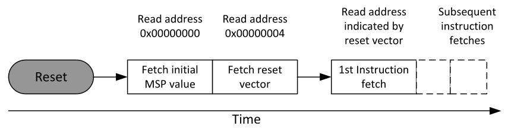

Como las operaciones de stack en los procesadores Cortex-M3 y Cortex-M4 se basan en un modelo *full descending*, el valor inicial del SP se debe setear en la primer dirección de memoria después del final de la región de stack.

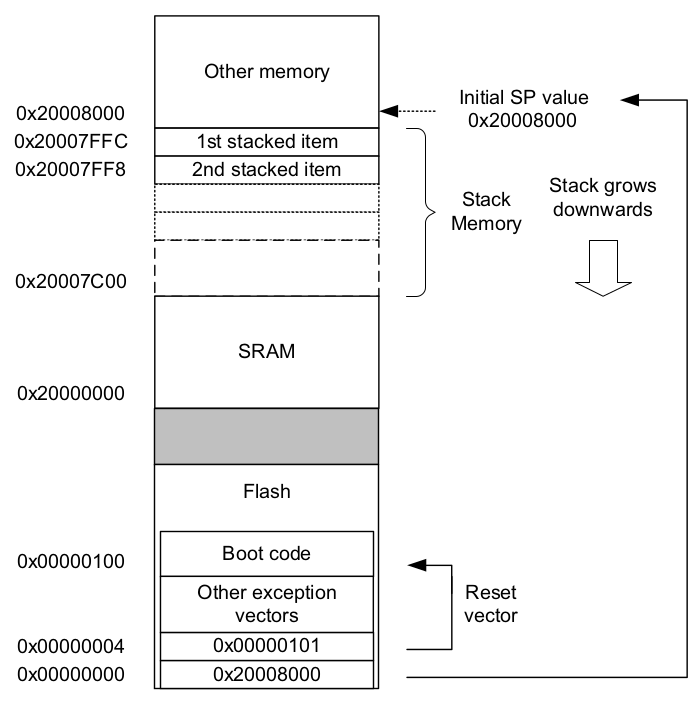

## Core peripherals
Se refieren a un set de periféricos integrados dentro del core del procesador y que, por lo tanto, esta acoplados estrechamente a él. Estan diseñados para soportar operaciones básicas del sistema y asistir en la efecución del software. 
Generalmente se accede a ellos a través de registros e instrucciones que provee la arquitectura.
Ejemplos de core peripherals son el NVIC (*Nested Vectored Interrupt Controller*) y el [SysTick](#systick-timer).

El resto de los periféricos en un microcontrolador pueden ser timers, UART para comunicación serial, SPI, I2C, GPIOs, etc. Estos extienden las funcionalidades del microcontroldor.
Entonces, la principal diferencia entre un core peripheral y el resto de los periféricos se encuentra en el nivel de integración con el core del procesador.

## Prioridad de interrupciones
Los procesadores Cortex-M3 y Cortex-M4 soportan hasta 256 niveles de prioridad programable (con un máximo de 128 niveles de pre-emption). Los fabricantes reducen la cantidad de niveles de prioridad configurable, para reducir la complejidad del NVIC, para reducir el consumo de energía y porque las aplicaciones solo necesitan un número reducido de prioridades.

Los niveles de prioridad de interuupción se controlan con registros de nivel de prioridad, que tendrán de 3 a 8 bits según la cantidad de niveles que implemente el fabricante. Por ejemplo, si un fabricante solo implementa 3 bits, el registro será como la siguiente figura y los niveles de prioridad disponibles serán 0x00 (la más alta), 0x20, 0x40, 0x60, 0x80, 0xA0, 0xC0 y 0xE0 (la más baja).

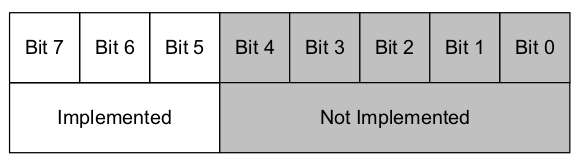

Solo hay 128 niveles de pre-emption disponibles porque los bits de nivel de prioridad implementados a su vez se dividen en dos partes: prioridad de grupo y subprioridad. Esa división se realiza mediante el registro de configuración *Priority Group* en el SCB (*System Control Block*).

El **nivel de prioridad de grupo** define si una interrupción puede tener lugar cuando el procesador ya se encuentra gestionando otra interrupción.
El **nivel de subprioridad** solo se utiliza qué interrupción debe gestionarse primero cuando ocurren dos excepciones pertenecientes al mismo grupo. 

La mayor cantidad de bits que puede asignarse a prioridad de grupo es 7, dejando un bit de subprioridadm por lo tanto la mayor cantidad de niveles de pre-emption que permite la arquitectura es 128.

Por ejemplo, si el *Priority Group* se setea en 5 cuando solo hay 3 bits implementados para niveles de interrupción, la configuración es la siguiente:

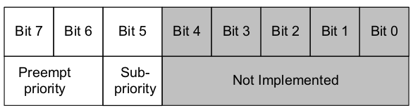

Se tendrán 4 niveles de prioridad de grupo (4 niveles de pre-emption) y cada grupo tendrá dos niveles de subprioridad.

## CMSIS
CMSIS fue desarrollado por ARM para permitir a los fabricantes de microcontroladores usar una infraestructura de software consistente a la hora de desarrollar soluciones de software para microcontroladores Cortex-M.

Fue iniciado como una forma de establecer consistencia entre las librería para drivers para microcontroladores Cortex-M, lo que se terminó convirtiendo en CMSIS-Core. Desde entonces, existen los siguientes proyectos:

- CMSIS-Core: un set de APIs para desarrolladores de aplicaciones o middleware con acceso a funcionalidades del procesador Cortex-M sin importar los dispositivos que utilice el microcontrolador.
- CMSIS-DSP: libreía para operaciones de procesamiento digital de señales (DSP) como la FFT o filtros.
- CMSIS-SVD: (*System View Description*) un mecanismo basado en XML para describir el set de periféricos en un microcontrolador.
- CMSIS-RTOS: Es una especificación de API para OS embebidos que corren en Cortex-M. Permite desarrollar aplicaciones para múltiples OS, mejorando la portabilidad y reusabilidad.
- CMSIS-DAP: (*Debug Access Port*) es una referencia para el diseño de interfaces de debug. Sporta USB, JTAG y otros.

En la siguiente imagen se observa la arquitectura de capas y cómo CMSIS interactúa con el resto del sistema:

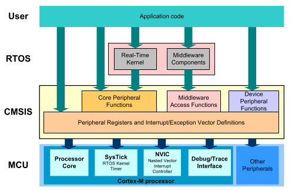

Las principales ventajas de utilizar CMSIS son la portabilidad y reusabilidad del código desarrollado.
Un proyecto desarrollado para un microcontrolador Cortex-M puede ser migrado de forma sencilla a un procesador Cortex-M diferente o al microcontrolador Cortex-M de un fabricante diferente.

## Secuencia de excepción
El procesador acepta una excepción si se cumplen las siguientes condiciones:

- El procesador se encuentra corriendo.
- La excepción se encuentra habilitada.
- La excepción tiene mayor prioridad que el nivel de prioridad actual.
- La excepción no esta bloqueada por ningun registro para enmascarar excepciones.

La **secuencia de entrada** de una excepción consiste en las siguientes operaciones:

- Stacking de varios registros, incluyendo la dirección de regreso del stack seleccionado actualmente. Esto permite a al handler de la excepción estar implementado como una función en C. Si el procesador se encuentra en modo Thread y utilizando el PSP, se utiliza esa región de stack para este stacking, de lo contrario se utiliza la región del MSP.
- Fetch del vector de la excepción (la dirección de inicio del handler de la excepción). Esto se puede realizar en paralelo con el stacking mencionado previamente.
- Fetch de las instrucciones del handler de la excepción a ejecutar.
- Actualización de varios registros del NVIC y el core. Esto incluye el estado pendiente y activo de la excepción, los registros como el PSR (*Program Status Register*), LR (*Link Register*), PC (*Program Counter*) y el SP (*Stack Pointer*).

Dentro de la **ejecución del handler** se pueden llevar a cabo las tareas necesarias para el periférico que solicitó el servicio. El procesador se encuentra en modo Handler y por lo tanto:

- Se utiliza el MSP para las operaciones de stack.
- El procesador tiene acceso privilegiado.

Si en este punto de ejecución llega una interrupeción de mayor prioridad, esta será aceptada y el handler en ejecución es suspendido y pre-empted por el handler de la interrupción de alta prioridad (interrupción anidada).

Si la nueva interrupción es de igual o menor prioridad, queda en estado pendiente y será atendida una vez que el handler actual se complete.

En los procesadores Cortex-M, el **mecanismo de retorno de la excepción** se desencadena utilizando una dirección de retorno especial denominada EXC_RETURN. Ese valor se genera en la entrada de la excepción y es almacenado en el LR. Cuando el valor se escribe en el PC con alguna de las instrucciones de retorno de excepción permitidas, se desencadena el macanismo de retorno.

Cuando se desencadena el mecanismo de retorno de la excepción, el procesador accede al valor de los registros que se pushearon en la pila durante la entrada a la excepción y los almacena nuevamente en el banco de registros (unstacking). Además, se actualizan los registros del NVIC  (estado activo) y del core (PSR, SP, CONTROL) correspondientes.

En paralelo a la operación de unstacking, el procesador puede iniciar el fetch de las instrucciones del programa interrumpido previamente para permitir la continuación de éste lo antes posible.

El uso del valor EXC_RETURN para desencadenar el retorno de la excepción permite que los handlers puedan ser implementados como funciones en C.

## Lazy stacking
El *lazy stacking* es una característica vinculada al stacking de registros en la unidad de puntos flotantes, por lo tanto solo es relevante en procesadores Cortex-M4 con FPU.

Si la FPU esta habilitada y se encuentra en uso, los registros en el banco de registros de la FPU contienen información que puede ser necesario guardar. Si se requiere colocar en la pila registros de punto flotante por cada excepción, es necesario llevar a cabo 17 operaciones de push a memoria adicionales, lo que incrisa la latencia de interrupción entre 12  29 ciclos.

Cuando ocurre una excepción con la FPU habilitada y en uso (indicado por el bit 2 de CONTROL denominado FPCA), se utiliza el formato de stack largo. Sin embargo, el mecanismo de *lazy stacking* reserva el espacio en pila para esos registros, pero solo coloca en la pila R0 a R3, R12, LR, la dirección de retorno y xPSR. De esta forma, la latencia de interrupción se mantiene en 12 ciclos. Si se realiza el *lazy stacking* un registro interno LSPACT (*Lazy Stacking Preservation Active*) se setea y otro registro denominado *Floating Point Context Address Register* (FPCAR) almacena la dirección del espacio de stack reservado para el registro de punto flotante.

Si el handler de la excepción no requiere operación de punto flotante, los registros de punto flotante se mantienen intactos durante toda la ejecución del handler. Si el handler de la excepción requiere operaciones de punto flotante, el procesador detecta el conflicto y detiene el procesador, realiza el push a stack de los registros de punto flotante en el espacio reservado para ello y limpia LSPACT. Luego de eso se retoma el handler de la excepción. De esta forma, el stack de los registros de punto flotante se realiza solo si es necesario.

## Tail chaining
Cuando ocurre una excepción mientras el procesador esta manejando otra de igual o mayor prioridad, esta entra en un estado pendiente.
Una vez que el procesador termina de gestionar la excepción, procede a gestionar la excepción pendiente.
En lugar de restablecer los registros del stack (unstacking) y pushear los mismos en el stack de nuevo, el procesador saltea los pasos de unstacking y stacking y directamente entra a manejar la excepción pendiente lo antes posible.
Haciendo esto el lapso de tiempo entre la gestión de dos excepciones se ve considerablemente reducido.
También se ve reducido el consumo de energía, reduciendo la cantidad de accesos a memoria.

Esta optimización es denominada *tail chaining*.

## Late arrival
Cuando ocurre una excepción, el procesador la acepta e inicia las operaciones de stacking. Si durante las operaciones de stacking ocurre otra excepción de mayor prioridad, se le da el servicio a la excepción de mayor prioridad, gestionandola tan pronto como se termina el stacking.

## SysTick timer
Los procesadores Cortex-M tienen integrado un timer pequeño denominado SysTick (System Tick). Es un timer de 24 bits de decremento simple y puede ejecutarse con la frecuencia de clock del procesador o de una referencia de clock externa.

En los RTOS es necesario una interrupción periódica que permite invocar al kernel del sistema operativo para, por ejemplo, la gestión de tareas y el cambio de contexto. El diseño del procesador también es tal que no permite que tareas en modo no privilegiado puedan deshabilitar el timer.

La razón por la que el timer se encuentra integrado dentro del procesador es ayudar a la portabilidad del software. Dado que todos los procesadores Cortex-M tienen el mismo timer SysTick, un sistema operativo desarrollado para una Cortex-M3/M4 determinado puede reutilizarse en otro microcontrolador Cortex-M3/M4.

Si la aplicación no utiliza un sistema operativo, el SysTick puede utilizarse como un timer convencional que permita generar interrupciones de forma periódica, generación de delays o medición de lapsos de tiempo.

## Unidad de protección de memoria (MPU)
La MPU es un dispositivo programable que puede utilizarse para definir permisos de acceso a memoria y atributos de memoria en diferentes regiones de la misma.

La MPU es opcional en procesadores Cortex-M3 y Cortex-M4, y aquellos que lo poseen soportan haste 8 regiones de memoria programables, cada uno con su propia dirección de inicio, tamaño y configuración.

En sistemas embebidos que requieren robustez y gran fiabilidad, la MPU puede utilizarse para:
- Prevenir que tareas de aplicación de corrompan la pila o información en memoria que es utilizada por otras tareas o el kernel del sistema operativo.
- Prevenir que tareas sin privilegios accedan a ciertos periféricos que pueden ser críticos en la fiabilidad y seguridad del sistema
- Definir espacio de SRAM o RAM como no ejecutable para prevenir ataques por inyección.

Si un acceso a memoria viola los permisos de acceso definidos por la MPU, la transferencia es bloqueada y se levanta una excepción. El manejador de la excepción luego decidirá si el sistema debe resetearse o únicamente se termina la tarea que produjo la excepción en un enterno con sistema operativo.

La MPU necesita ser programada y habilitada previo a utilizarse. Las regiones de la MPU puede sobreponerse. Si un sector memoria cae entre dos regiones programados por la MPU, los atributos de acceso y permisos se definen basándose en la región con valor numérico más alto. Por ejemplo, si una dirección de transferencia se ubica dentro del rango definido por la región 1 y la región 4, se utilizará la configuración de la región 4.

## Excepción SVC (SuperVisor Call)
Es una excepción, generalmente utilizada en sistemas con un RTOS, que puede generarse en modo no privilegiado a través de la instrucción SCV, para despertar el NVIC por software.
Es un mecanismo mediante el cual una tarea con acceso no privilegiado puede solicitar un servicio al OS (que tiene acceso privilegiado).

La tarea puede solicitar un servicio sin conocer la dirección de memoria asociada, solo necesita saber el número de servicio del SVC, los parámetros de entrada y lo que debe esperar como resultado. Luego el OS se encargará de decidir si responder la solicitud o no.

Es la excepción 11 del vector de interrupciones (número de interrupción -5 de CMSIS).

La instrucción SVC necesita que la prioridad de la excepción SVC sea mayor a la prioridad actual y que la excepción no es encuentre enmascarada por registros como PRIMASK. Si esto no se cumple, se producirá una excepción de falla.

## Excepción PendSV
Es la excepción 14 y tiene prioridad programable. Es una excepción generada seteando su estado pendiente escribiendo el registro ICSR (*Interrupt Control and State Register*). A diferencia de la excepción SVC, no es precisa, por lo que su estado pendiente puede setearse dentro del manejador de un interrupción de mayor prioridad y ejecutarse cuando dicha interrupción finalice.

Puede programarse para ser ejecutada una vez que todas las tareas de interrupción han sido procesadas, asegurándose que PendSV tiene la prioridad de excepción más baja. Esto es muy útil para la operación de cambio de contexto.

A continuación un ejemplo del uso de PendSV para las operaciones de cambio de contexto:

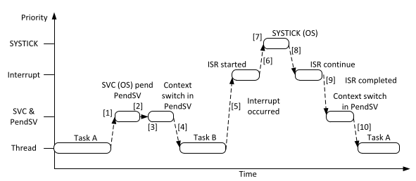

1. La tarea A llama a SVC para realizar un cambio de contexto.
2. El OS recibe la solicitud, prepara el cambio de contexto, y setea el estado pendiendo de PendSV.
3. Al finalizar CSV, entra a PendSV inmediatamente y realiza el cambio de contexto.
4. Cuando PendSV finaliza, vuelve a Thread y ejecuta la tarea B.
5. Ocurre una interrupción y se entra a la rutina correspondiente.
6. Mientras se ejecuta la rutina de interrupción, se genera una exepción de SysTick.
7. El OS realiza las tareas necesarias y setea el estado pendiente de PendSV para preparar el cambio de contexto.
8. Al finalizar la excepción de SysTick, continua la rutina de interrupción.
9. Cuando finaliza la rutina de interrupción, PendSV inicia y realiza el cambio de contexto.
10. Cuando finaliza PendSV, vuelve a Thread y se ejecuta la tarea A.

Además de su aplicación para cambio de contexto, PendSV puede utilizarse en sistemas sin un OS. Por ejemplo, cuando una rutina de interrupción necesita un tiempo de procesamiento considerable pero solo una primera porción del procesamiento necesita una prioridad muy alta. Si toda la ISR se ejecuta con prioridad alta, el resto de las rutinas de interrupción quedarán bloqueadas durante ese período. En esos casos se puede dividir la rutina en dos:

- Una primera porción, que debe ejecutarse con alta prioridad y muy rápido, se coloca en una rutina de interrupción convencional. Al final de esa rutina se setea el estado pendiente de PendSV.
- Una segunda porción, con el resto del procesamiento necesario, se coloca en el manejador de PendSV y se ejecuta con baja prioridad.